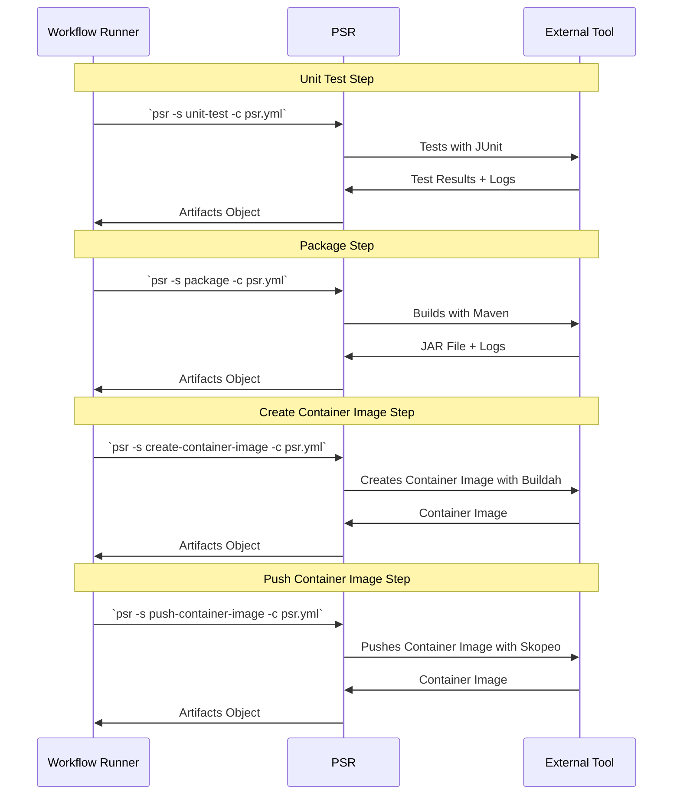
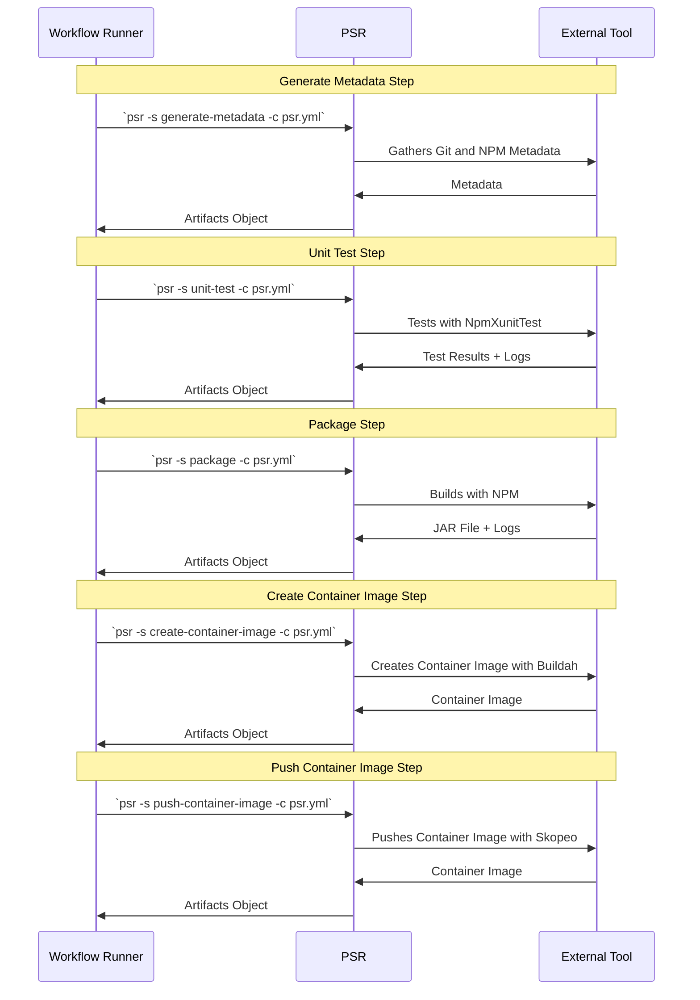

# End-to-End Ploigos Step Runner (PSR) Example

Below is an end-to-end example pipeline that leverages PSR.

## Example Scenario

- We have two applications
    - First is a Java Spring backend API built with Maven
    - Second is a JavaScript React frontend built with NPM
- We want to build a pipeline that has 5 stages
    - Generate Metadata
    - Unit test
    - Package
    - Create Container Image
    - Push Container Image
- We want to use Jenkins as the workflow runner

## Step 1: Configure *psr.yaml* for Maven

Create a *psr.yaml* file in the source code repo for the Spring application:

```yaml
create-container-image:
  - implementer: Buildah

generate-metadata:
  - implementer: Maven

package:
  - implementer: MavenPackage

push-container-image:
  - implementer: Skopeo
    config:
      destination: 'quay.io/my-org/backend'

unit-test:
    - implementer: MavenTest
```

> :notebook: The order in psr.yaml does not matter. Additionally, even if a
> step appears in psr.yaml, the step must be explicitly called by the workflow
> runner. psr.yaml contains configurations for your steps when they are
> executed by the pipeline. The pipeline definition for your workflow runner
> will dictate what steps are called and in what order.

## Step 2: Configure *psr.yaml* for NPM

Create a *psr.yaml* file in the source code repo for the NPM application:

```yaml
create-container-image:
  - implementer: Buildah

generate-metadata:
  - implementer: NPM

package:
  # WARNING: not yet implemented
  - implementer: NPM
    config: {}

push-container-image:
  - implementer: Skopeo
    config:
      destination: 'quay.io/my-org/frontend'

unit-test:
- implementer: NpmXunitTest
  config:
    test-reports-dir: test_results
```

## Step 3: Create a Jenkinsfile

Jenkins needs to call the PSR command with two options:

- `-s <step>` is the name of the step that will be executed
- `-c psr.yml` is the path to the PSR configuration file for the application

Create a Jenkinsfile in both source code repos that contains the same pipeline
definition:

```Jenkinsfile
pipeline {
    agent {
        docker {
            image 'TODO: Add image? Maybe...'
        }
    }

    stages {
        stage('Generate Metadata') {
            steps {
                psr -s unit-test -c psr.yaml
            }
        }
        stage('Unit Test') {
            steps {
                psr -s unit-test -c psr.yaml
            }
        }
        stage('Package') {
            steps {
                psr -s package -c psr.yaml
            }
        }
        stage('Create Container Image') {
            steps {
                psr -s create-container-image -c psr.yaml
            }
        }
        stage('Push Container Image') {
            steps {
                psr -s create-container-image -c psr.yaml
            }
        }
    }
}
```

This Jenkinsfile will be used for both the Maven and NPM applications. PSR
provides each step and one or many implementers for that step. The PSR commands
remain the same between applications because the Java (Maven) and JavaScript
(NPM) applications reference different implementers in their psr.yaml files.

## Appendix A: Pipeline Flow for Maven App



## Appendix B: Pipeline Flow for NPM App


